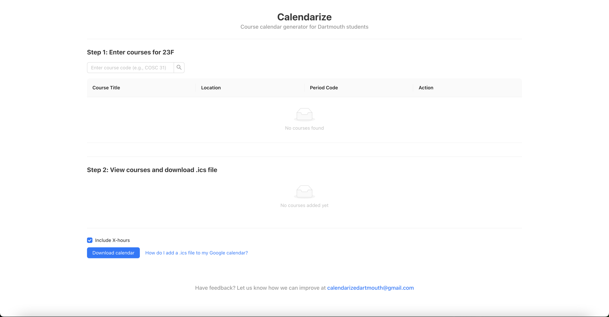
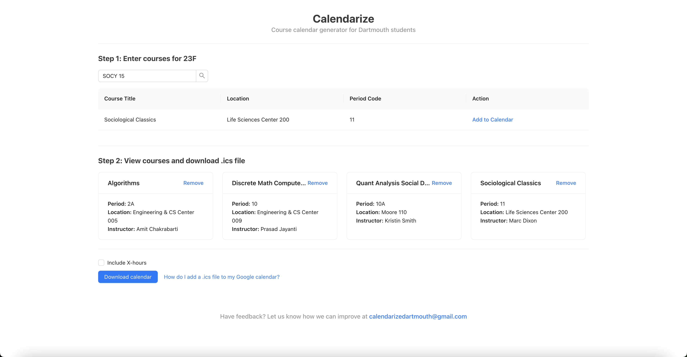
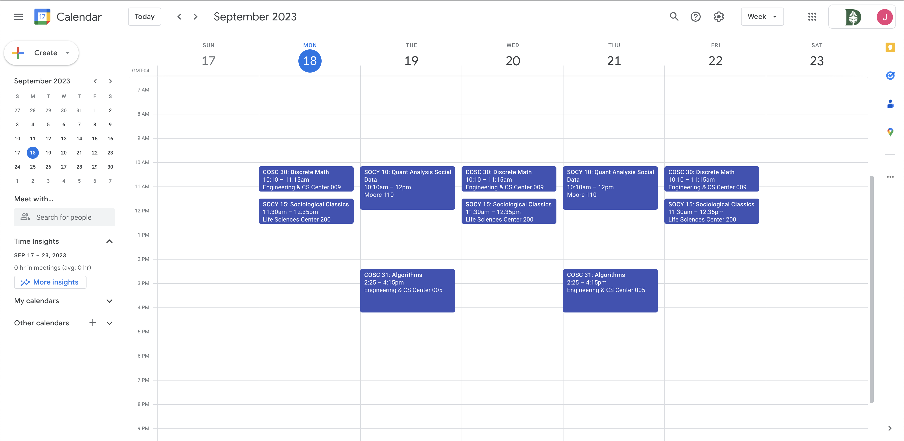
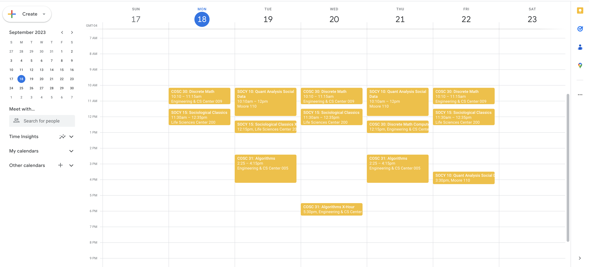
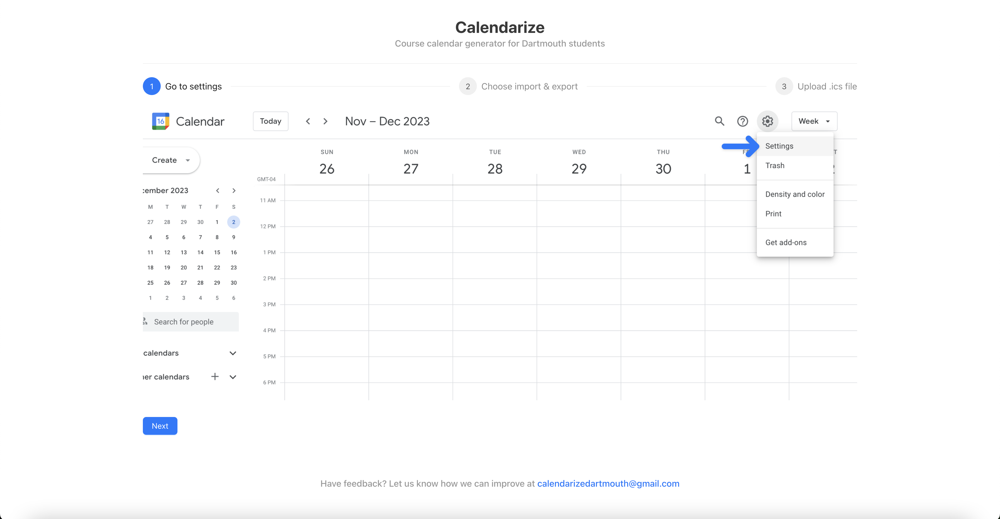

# Hack Technology / Project Attempted

## What you built? 

At the start of every term, (organized) Dartmouth students diligently put their courses into their calendar. However, this process is tedious and prone to mistakes. We built a tool that allows Dartmouth students to quickly generate a calendar with their courses to import into a calendar application of their choosing to expedite this process.

Landing Page:

Classes Added:

Full Calendar Example, no X-Hours:

Full Calendar Example, with X-Hours:

Tutorial Page:

## Who Did What?

Josh worked on the design of each component (course search, course cards, .ics import tutorial). He also implemented the course search webscraping logic.

Jack worked on the .ics download and redux. He also implemented the date-finding webscraping logic (which is used when creating the .ics file).

## What you learned

We tried out TypeScript for this application and really liked the benefits of static typing. Even though it came at the expense of some boilerplate code in setting up interfaces and declaring types for variables, the gains in terms of bug-catching, documentation, and improved clarity were well worth it. We also tried out webscraping for the first time, and learned how to scrape information off of webpages for use in our application. Additionally, we worked with a new filetype (.ics) used for storing calendar data.

## Authors

Josh Pfefferkorn and Jack Gnibus

## Next Steps

- Course autocomplete
- How-to-use tour
- Export directly to calendar application of choice
- Map functionality? Could be cool

## Acknowledgments

[React Redux with TypeScript](https://react-redux.js.org/introduction/getting-started)

[ICS NPM Documentation](https://www.npmjs.com/package/ics)

ChatGPT used occassionally for small functions, cited in code